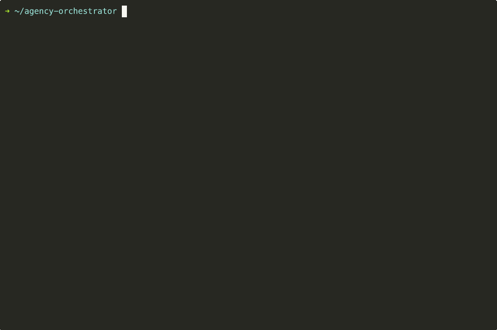
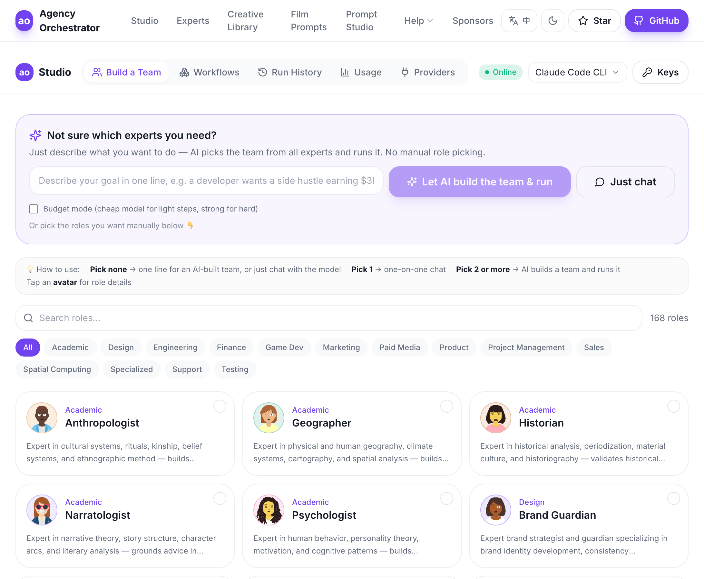
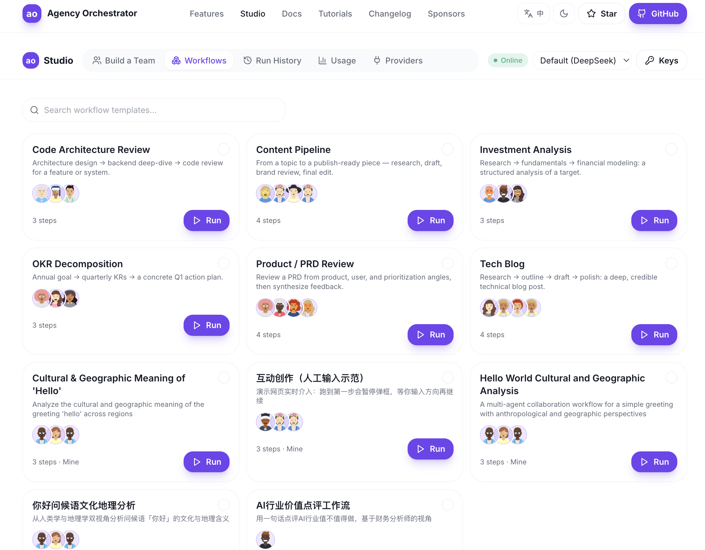

# Agency Orchestrator

**English** | [中文](./README.md)

> **One sentence in, a full plan out — multiple AI roles collaborate automatically.**

[](https://github.com/jnMetaCode/agency-orchestrator/actions)
[](https://www.npmjs.com/package/agency-orchestrator)
[](./LICENSE)
[](./CONTRIBUTING.md)

**One sentence → full plan · 216 expert AI roles · Zero-code YAML · 10 LLM providers · key supported (DeepSeek recommended), plus 7 key-free options**

> **Note:** `ao compose --run` auto-detects your language. Both 216 Chinese roles and 184 English roles ([agency-agents](https://github.com/msitarzewski/agency-agents), MIT) are **bundled in the npm package — no extra download needed**. **10 English workflow templates** are ready in `workflows/en/`.

> 📖 [Full Tutorial](https://dev.to/jnmetacode/agency-orchestrator-one-sentence-five-ai-agents-a-complete-plan-in-3-minutes-1ij6) — from install to real-world use in 10 minutes

> If you find this useful, please **Star** it — helps others discover the project.

<p align="center">
  
</p>

---

## Web Studio (GUI)

Prefer not to use the command line? Run `ao web` locally and pick experts, run workflows, view outputs, and intervene live — all in a GUI, fully bilingual (EN/中文).

<p align="center">
  <br/>
  <em>Build a Team: pick from 200+ experts; AI composes and runs the team</em>
</p>

<p align="center">
  <br/>
  <em>Workflows: run built-in templates with one click, or compare several</em>
</p>

> Launch: `ao web` (local — your API key stays on your machine, never uploaded). A [desktop client download](https://github.com/jnMetaCode/agency-orchestrator/releases/latest) (Electron · macOS / Windows / Linux) is also available.

---

## One Sentence, Full Result

```bash
ao compose "I'm a programmer looking to start a side hustle with AI content, target $3K/month, give me a complete plan" --run
```

5 AI roles collaborate automatically:

```
  Workflow: Programmer AI Side Hustle Plan
  Steps: 5 | Model: claude-code
  Roles: 🔭 Trend Researcher | 📱 Platform Analyst | 💰 Financial Planner | ✍️ Content Strategist | 📋 Execution Planner
──────────────────────────────────────────────────

  ✅ 🔭 Trend Researcher   31.3s  → 6 niches compared by competition/ceiling/AI leverage
  ✅ 📱 Platform Analyst    32.0s  → 6 platforms scored, recommends "YouTube + Newsletter" combo
  ✅ 💰 Financial Planner   31.8s  → $3K/mo breakdown: course $1,800 + community $600 + consulting $600
  ✅ ✍️ Content Strategist   44.6s  → 20 topics + 4 headline formulas + content SOP
  ✅ 📋 Execution Planner   42.2s  → 90-day action plan, day-by-day

==================================================
  Done: 5/5 steps | 182.1s | 6,493 tokens
==================================================
```

**No code. No config. No role selection.** One sentence → AI auto-decomposes the task → matches roles from 216 experts → executes as DAG → outputs a complete plan.

### What Can You Build

```bash
ao compose "Analyze the feasibility of building an AI budgeting app" --run        # Startup feasibility
ao compose "Compare Cursor, Windsurf, and Copilot — give me a recommendation" --run  # Tech comparison
ao compose "Write a deep-dive article on AI Agent trends" --run                    # Long-form writing
ao compose "Plan an AI education startup with $15K budget" --run                   # Business plan
ao compose "PR code review covering security and performance" --run                # Code review
ao compose "Design a pricing strategy for a SaaS product" --run                    # Pricing analysis
```

Each scenario auto-matches a different combination of AI roles.

---

## Why Agency Orchestrator

Chatting with one AI gives you one perspective. But any real decision needs product, engineering, finance, and marketing perspectives...

**Agency Orchestrator = multiple AI experts working in parallel, then synthesized. One person vs. a whole team.**

| | ChatGPT / Claude | CrewAI / LangGraph | **Agency Orchestrator** |
|---|--------|-----------|---------------------|
| Roles | 1 generalist | Write your own | **216 expert roles** |
| Usage | Chat | Write Python | **One sentence / YAML** |
| API key | — | Required | **Key supported; 7 key-free options too** |
| Dependencies | — | pip + dozens of packages | **npm + 2 deps** |
| Parallelism | — | Manual graph | **Auto DAG detection** |
| Price | Subscription | Open-source + API fees | **DeepSeek sweet spot is dirt cheap; key-free to start** |

## Get Started in 3 Steps

### Step 1: Install

```bash
npm install -g agency-orchestrator
```

### Step 2: One sentence, go

```bash
# Use your existing Claude subscription (no API key needed)
ao compose "Analyze the feasibility of building an AI budgeting app" --run --provider claude-code

# Or use DeepSeek ($2 lasts forever)
export DEEPSEEK_API_KEY="your-key"
ao compose "Analyze the feasibility of building an AI budgeting app" --run
```

### Step 3: Use built-in templates or integrate with AI coding tools

```bash
# 10 English workflow templates in workflows/en/
ao run workflows/en/solo-founder-plan.yaml -i idea="AI-powered resume builder for job seekers"
ao run workflows/en/pr-review.yaml -i pr_diff=@mypr.diff -i pr_description="Add auth middleware"
ao run workflows/en/business-plan.yaml -i idea="B2B SaaS for remote-team project tracking"
```

Also works inside Cursor / Claude Code — just say "run a workflow." Supports **14 AI coding tools** ([integration guides](./integrations/)).

## More Real Demos

```
$ ao compose "Analyze startup opportunities in short-form video" --run

  Workflow: Short-Form Video Startup Opportunity Analysis
  Steps: 6 | Concurrency: 2 | Model: deepseek-chat
  Roles: 👔 CEO | 📊 Market Researcher | 🔍 User Researcher | 🧭 Product Manager | 📣 Marketing Lead | 💰 CFO
──────────────────────────────────────────────────

  ✅ 👔 CEO              12.7s   → Strategic direction & target user positioning
  ✅ 📊 Market Researcher 45.2s   → 700M DAU data, competitive landscape analysis
  ✅ 🔍 User Researcher   38.1s   → User personas, pain points, willingness to pay
  ✅ 🧭 Product Manager   41.3s   → MVP feature list, content matrix, monetization paths
  ✅ 📣 Marketing Lead    35.6s   → Cold start plan, ad strategy, user funnel
  ✅ 💰 CFO              28.4s   → $200K startup, $550K first-year revenue, break-even analysis

==================================================
  Done: 6/6 steps | 233.0s | 65,191 tokens
==================================================
```

Of the 6 roles, Market Researcher and User Researcher **run in parallel** (auto-detected from DAG dependencies).

## How It Works

```yaml
name: "Product Requirements Review"
agents_dir: "agency-agents"      # or "agency-agents-zh" for Chinese roles

llm:
  provider: "deepseek"          # No API key: claude-code / gemini-cli / copilot-cli / codex-cli / hermes-cli / ollama
  model: "deepseek-chat"

concurrency: 2

inputs:
  - name: prd_content
    required: true

steps:
  - id: analyze
    role: "product/product-manager"
    task: "Analyze this PRD and extract core requirements:\n\n{{prd_content}}"
    output: requirements

  - id: tech_review
    role: "engineering/engineering-software-architect"
    task: "Evaluate technical feasibility:\n\n{{requirements}}"
    output: tech_report
    depends_on: [analyze]

  - id: design_review
    role: "design/design-ux-researcher"
    task: "Evaluate UX risks:\n\n{{requirements}}"
    output: design_report
    depends_on: [analyze]

  - id: summary
    role: "product/product-manager"
    task: "Synthesize feedback:\n\n{{tech_report}}\n\n{{design_report}}"
    depends_on: [tech_review, design_review]
```

The engine automatically:

1. Parses YAML → builds a **DAG** (directed acyclic graph)
2. Detects parallelism — `tech_review` and `design_review` run concurrently
3. Passes outputs between steps via `{{variables}}`
4. Loads role definitions from [agency-agents](https://github.com/msitarzewski/agency-agents) (or [agency-agents-zh](https://github.com/jnMetaCode/agency-agents-zh)) as system prompts
5. Retries on failure (exponential backoff)
6. Saves all outputs to `ao-output/`

```
analyze ──→ tech_review  ──→ summary
         └→ design_review ──┘
          (parallel)
```

## 10 LLM Providers — 7 Need No API Key

**Already paying for one of these? You're ready to go:**

| You have... | Provider config | Install CLI | Cost to you |
|------------|----------------|-------------|-------------|
| Claude Max/Pro ($20/mo) | `provider: "claude-code"` | `npm i -g @anthropic-ai/claude-code` | **$0 extra** |
| Google Account | `provider: "gemini-cli"` | `npm i -g @google/gemini-cli` | **Free** (1000 req/day, Gemini 2.5 Pro) |
| GitHub Copilot ($10/mo) | `provider: "copilot-cli"` | `npm i -g @github/copilot` | **$0 extra** |
| ChatGPT Plus ($20/mo) | `provider: "codex-cli"` | `npm i -g @openai/codex` | **$0 extra** |
| OpenClaw account | `provider: "openclaw-cli"` | `npm i -g openclaw` | **$0 extra** |
| Hermes Agent (NousResearch open-source 🔥) | `provider: "hermes-cli"` | [Install guide](https://github.com/NousResearch/hermes-agent) | **Free** |
| A computer | `provider: "ollama"` | [ollama.ai](https://ollama.ai) | **Free** (local models, see note below) |

> ⚠️ **Model capability drives the value of multi-agent.** We verified this with a quality eval (see [EVAL_FINDINGS.md](EVAL_FINDINGS.md)): on the **DeepSeek tier (capable yet cheap), multi-agent output clearly beats a single prompt**; but with **weak local models (e.g. llama3 8B), the role hand-offs amplify drift and can do worse than a single call**. For quality, use a capable model (DeepSeek/Claude/Gemini); for local Ollama, prefer 70B+ models.

**Or use traditional API keys (DeepSeek recommended for the price/quality sweet spot):**

| Provider | Config | Env Variable |
|----------|--------|-------------|
| DeepSeek | `provider: "deepseek"` | `DEEPSEEK_API_KEY` |
| Claude API | `provider: "claude"` | `ANTHROPIC_API_KEY` |
| OpenAI | `provider: "openai"` | `OPENAI_API_KEY` |

**Custom API (any OpenAI-compatible endpoint):**

```bash
ao init --provider openai --model model-name \
  --base-url https://your-api-endpoint/v1 \
  --api-key your-key
```

Or edit `.env` manually:

```env
AO_PROVIDER=openai
AO_MODEL=model-name
OPENAI_BASE_URL=https://your-api-endpoint/v1
OPENAI_API_KEY=your-key
```

> ⚠️ Use `provider: "openai"` for third-party APIs, not `provider: "ollama"`. Ollama is for local models only and does not send API keys.

## CLI Reference

```bash
ao demo                              # Zero-config multi-agent demo
ao init                              # (Optional) Copy 216 Chinese roles locally for editing
ao init --lang en                    # (Optional) Copy 184 English roles locally for editing
ao init --workflow                    # Interactive workflow creator
ao compose "description"             # AI-powered workflow generation
ao compose "description" --run       # Generate AND execute in one command
ao team save <workflow.yaml>         # Save a role line-up as a reusable team (Loadout)
ao team list / show / rm             # Manage saved teams
ao run --team <name> "new task"      # Run a new task with a saved team (locked line-up)
ao prompt optimize "<prompt>"        # AI-optimize a prompt (--save to keep it reusable)
ao prompt test / list / garden       # Test / manage / starter templates (prompt library)
ao run <workflow.yaml> [options]      # Execute workflow
ao validate <workflow.yaml>          # Validate without running
ao plan <workflow.yaml>              # Show execution plan (DAG)
ao explain <workflow.yaml>           # Explain execution plan in natural language
ao roles                             # List all available roles
ao serve                             # Start MCP Server (for Claude Code / Cursor)
```

| Option | Description |
|--------|-------------|
| `--input key=value` | Pass input variables |
| `--input key=@file` | Read variable value from file |
| `--output dir` | Output directory (default `ao-output/`) |
| `--resume <dir\|last>` | Resume from previous run |
| `--from <step-id>` | With `--resume`, restart from a specific step |
| `--watch` | Real-time terminal progress display |
| `--quiet` | Quiet mode |

### AI Workflow Composer

Describe your workflow in one sentence — AI selects the right roles, designs the DAG, and generates a ready-to-run YAML:

```bash
ao compose "PR code review covering security and performance"
```

The AI will:
1. Select matching roles from 216 available (e.g., Code Reviewer, Security Engineer, Performance Benchmarker)
2. Design the DAG (3-way parallel → summary)
3. Generate complete YAML with variable passing and task descriptions
4. Save to `workflows/` — ready to `ao run`

Add `--run` to generate and execute in one command. Supports `--provider` and `--model` flags (default: DeepSeek).

### Teams / Loadouts (save a winning line-up and reuse it)

Every `compose` builds an ad-hoc team. When a line-up works well, **save it as a team** and apply it to any new task — a team stores only the *roles*, decoupled from any specific task:

```bash
# Extract the line-up from a workflow that worked well, save it as a team
ao team save workflows/tech-blog.yaml --name blog-crew

# Put the whole crew on a new task (re-designs the steps for those roles and runs)
ao run --team blog-crew "Write an explainer on the RISC-V architecture"

ao team list           # List saved teams
ao team show blog-crew # Inspect the line-up
```

`ao run --team` simply **locks** the compose role catalog down to the team's roles — so nobody is dropped and no role is hallucinated. Teams live in `~/.ao/teams/*.team.yaml` (plain YAML, copy-to-share) and are **shared between the CLI and the web Studio** — pick roles in Studio, hit "Save as team", and `ao run --team` can use it immediately, and vice versa.

> Bring your own experts: set `AO_AGENTS_DIR=/your/roles/dir` and `run / compose / roles / web` all switch to your own role library.

### Prompt Lab

Turn gut-feel prompts into assets you can optimize, test, compare, and save:

```bash
ao prompt optimize "write a tweet selling coffee" --save coffee-copy   # AI rewrites it into a sharper prompt
ao prompt test "You are a translator, output only the translation" --mode system --input "good morning"
ao prompt list / show coffee-copy   # saved prompts + version history
ao prompt garden                    # built-in starter templates
```

`--mode system|user` distinguishes role/system prompts from task prompts. Optimize only ever produces a **better prompt** (it never executes the prompt). The Studio "Prompts" tab adds side-by-side original-vs-optimized comparison **with AI scoring**. Stored in `~/.ao/prompts/` (`AO_PROMPTS_DIR` to override), shared between CLI and Studio.

### Resume & Iterate

Not happy with a step? No need to start over. `--resume` reloads previous outputs, `--from` specifies where to restart:

```bash
# Round 1: Normal run
ao run workflows/en/solo-founder-plan.yaml -i idea="AI-powered resume builder for job seekers"

# Marketing plan needs work? Re-run from that step
ao run workflows/en/solo-founder-plan.yaml --resume last --from marketing_plan

# Only redo the final decision
ao run workflows/en/solo-founder-plan.yaml --resume last --from ceo_decision
```

Each round saves to a new timestamped directory in `ao-output/`. All versions are preserved.

| Scenario | Command |
|----------|---------|
| First run | `ao run workflow.yaml -i key=value` |
| Re-run from a step | `ao run workflow.yaml --resume last --from <step-id>` |
| Re-run only failed steps | `ao run workflow.yaml --resume last` |
| Resume specific version | `ao run workflow.yaml --resume ao-output/<dir>/ --from <step-id>` |

## MCP Server Mode

AI coding tools (Claude Code, Cursor, etc.) can invoke workflow operations directly via the MCP protocol:

```bash
ao serve              # Start MCP stdio server
ao serve --verbose    # With debug logging
```

Claude Code (`settings.json`):

```json
{
  "mcpServers": {
    "agency-orchestrator": {
      "command": "npx",
      "args": ["agency-orchestrator", "serve"]
    }
  }
}
```

Cursor (`.cursor/mcp.json`):

```json
{
  "mcpServers": {
    "agency-orchestrator": {
      "command": "npx",
      "args": ["agency-orchestrator", "serve"]
    }
  }
}
```

6 tools available: `run_workflow`, `validate_workflow`, `list_workflows`, `plan_workflow`, `compose_workflow`, `list_roles`.

## YAML Schema

### Workflow

| Field | Type | Required | Description |
|-------|------|----------|-------------|
| `name` | string | Yes | Workflow name |
| `agents_dir` | string | Yes | Path to role definitions directory |
| `llm.provider` | string | Yes | `claude-code` / `gemini-cli` / `copilot-cli` / `codex-cli` / `openclaw-cli` / `hermes-cli` / `ollama` / `claude` / `deepseek` / `openai` |
| `llm.model` | string | Yes | Model name |
| `llm.max_tokens` | number | No | Default 4096 |
| `llm.timeout` | number | No | Step timeout in ms (default API 120000 / CLI/ollama 600000). Automatically extends x1.5 on timeout retry up to 3600000. `0` means no timeout |
| `llm.retry` | number | No | Retry count (default 3) |
| `concurrency` | number | No | Max parallel steps (default 2) |
| `inputs` | array | No | Input variable definitions |
| `steps` | array | Yes | Workflow steps |

### Step

| Field | Type | Required | Description |
|-------|------|----------|-------------|
| `id` | string | Yes | Unique step identifier |
| `role` | string | Yes | Role path (e.g. `"engineering/engineering-sre"`) |
| `task` | string | Yes | Task description, supports `{{variables}}` |
| `output` | string | No | Output variable name |
| `depends_on` | string[] | No | Dependent step IDs |
| `depends_on_mode` | string | No | `"all"` (default) or `"any_completed"` |
| `condition` | string | No | Condition expression; step skipped if not met |
| `type` | string | No | `"approval"` for human approval gate |
| `prompt` | string | No | Prompt text for approval nodes |
| `loop` | object | No | Loop config |
| `loop.back_to` | string | No | Step ID to loop back to |
| `loop.max_iterations` | number | No | Max loop rounds (1-10) |
| `loop.exit_condition` | string | No | Exit condition expression |

## Programmatic API

```typescript
import { run } from 'agency-orchestrator';

const result = await run('workflow.yaml', {
  prd_content: 'Your PRD here...',
});

console.log(result.success);     // true/false
console.log(result.totalTokens); // { input: 1234, output: 5678 }
```

## Integrations

Works with **14 AI coding tools** — install with one command:

```bash
./scripts/install.sh                       # auto-detect installed tools
./scripts/install.sh --tool copilot        # or specify one
```

| Tool | Config Location | Install Command | Docs |
|------|----------------|----------------|------|
| **Claude Code** | Skill mode | `--tool claude-code` | [Guide](./integrations/claude-code/) |
| **GitHub Copilot** | `.github/copilot-instructions.md` | `--tool copilot` | [Guide](./integrations/copilot/) |
| **Cursor** | `.cursor/rules/` | `--tool cursor` | [Guide](./integrations/cursor/) |
| **Windsurf** | `.windsurfrules` | `--tool windsurf` | [Guide](./integrations/windsurf/) |
| **Kiro** | `.kiro/steering/` | `--tool kiro` | [Guide](./integrations/kiro/) |
| **Trae** | `.trae/rules/` | `--tool trae` | [Guide](./integrations/trae/) |
| **Aider** | `CONVENTIONS.md` | `--tool aider` | [Guide](./integrations/aider/) |
| **Gemini CLI** | `GEMINI.md` | `--tool gemini-cli` | [Guide](./integrations/gemini-cli/) |
| **Codex CLI** | `.codex/instructions.md` | `--tool codex` | [Guide](./integrations/codex/) |
| **OpenCode** | `.opencode/instructions.md` | `--tool opencode` | [Guide](./integrations/opencode/) |
| **Qwen Code** | `.qwen/rules/` | `--tool qwen` | [Guide](./integrations/qwen/) |
| **DeerFlow 2.0** | `skills/custom/` | `--tool deerflow` | [Guide](./integrations/deerflow/) |
| **Antigravity** | `AGENTS.md` | `--tool antigravity` | [Guide](./integrations/antigravity/) |
| **OpenClaw** | Skill mode | `--tool openclaw` | [Guide](./integrations/openclaw/) |

## English Workflow Templates (6)

Ready to run with `agency-agents` English roles:

| Template | Roles | Description |
|----------|-------|-------------|
| `en/solo-founder-plan.yaml` | CEO, Market/User Researcher, Tech Lead, Brand, PM, Marketing, CFO | **Solo founder all-hands** — one sentence → 8 departments plan → CEO decision |
| `en/pr-review.yaml` | Code Reviewer, Security Engineer, Performance Benchmarker | PR review (3-way parallel → merge verdict) |
| `en/product-review.yaml` | PM, Architect, UX Researcher | PRD review (tech + design parallel → synthesis) |
| `en/business-plan.yaml` | Trend Researcher, FP&A Analyst, PM, Executive Summary | Business plan (market → parallel forecast + roadmap → plan) |
| `en/content-pipeline.yaml` | Social Strategist, Content Creator, Growth Hacker | Content pipeline (research → draft → brand review → finalize) |
| `en/competitor-analysis.yaml` | Trend Researcher, Analytics Reporter, SEO Specialist, Executive Summary | Competitor report (research → data + SEO parallel → summary) |

```bash
ao run workflows/en/solo-founder-plan.yaml -i idea="Your idea here"
```

---

## Chinese Workflow Templates (32)

> Available via `ao init` (Chinese mode). Use `agency-agents-zh` roles.

### Dev Workflows (7)

| Template | Roles | Description |
|----------|-------|-------------|
| `dev/tech-design-review.yaml` | Architect, Backend Architect, Security Engineer, Code Reviewer | **Tech design review** (design → parallel review → verdict) |
| `dev/pr-review.yaml` | Code Reviewer, Security Engineer, Performance Benchmarker | PR review (3-way parallel → summary) |
| `dev/tech-debt-audit.yaml` | Architect, Code Reviewer, Test Analyst, Sprint Prioritizer | Tech debt audit (parallel → prioritize) |
| `dev/api-doc-gen.yaml` | Tech Writer, API Tester | API doc generation (analyze → validate → finalize) |
| `dev/readme-i18n.yaml` | Content Creator, Tech Writer | README internationalization |
| `dev/security-audit.yaml` | Security Engineer, Threat Detection Engineer | Security audit (parallel → report) |
| `dev/release-checklist.yaml` | SRE, Performance Benchmarker, Security Engineer, PM | Release Go/No-Go decision |

### Marketing Workflows (3)

| Template | Roles | Description |
|----------|-------|-------------|
| `marketing/competitor-analysis.yaml` | Trend Researcher, Analyst, SEO Specialist, Executive Summary | **Competitor analysis** (research → parallel analysis → summary) |
| `marketing/xiaohongshu-content.yaml` | Xiaohongshu Expert, Creator, Visual Storyteller, Operator | **Xiaohongshu content** (topic → parallel creation → optimize) |
| `marketing/seo-content-matrix.yaml` | SEO Specialist, Strategist, Content Creator | **SEO content matrix** (keywords → strategy → batch generate → review) |

### Data / Design / Ops Workflows (7)

| Template | Roles | Description |
|----------|-------|-------------|
| `data/data-pipeline-review.yaml` | Data Engineer, DB Optimizer, Data Analyst | Data pipeline review |
| `data/dashboard-design.yaml` | Data Analyst, UX Researcher, UI Designer | Dashboard design |
| `design/requirement-to-plan.yaml` | PM, Architect, Project Manager | Requirements → tech design → task breakdown |
| `design/ux-review.yaml` | UX Researcher, Accessibility Auditor, UX Architect | UX review |
| `ops/incident-postmortem.yaml` | Incident Commander, SRE, PM | Incident postmortem |
| `ops/sre-health-check.yaml` | SRE, Performance Benchmarker, Infra Ops | SRE health check (3-way parallel) |
| `ops/weekly-report.yaml` | Meeting Assistant, Content Creator, Executive Summary | **Weekly/monthly report** (organize → highlights → finalize) |

### Strategy / Legal / HR Workflows (3)

| Template | Roles | Description |
|----------|-------|-------------|
| `strategy/business-plan.yaml` | Trend Researcher, Financial Forecaster, PM, Executive Summary | **Business plan** (market → parallel analysis → integrate) |
| `legal/contract-review.yaml` | Contract Reviewer, Legal Compliance | **Contract review** (clause analysis → compliance → opinion) |
| `hr/interview-questions.yaml` | Recruiter, Psychologist, Backend Architect | **Interview questions** (dimensions → parallel design → scorecard) |

### General Workflows (12)

| Template | Roles | Description |
|----------|-------|-------------|
| `product-review.yaml` | PM, Architect, UX Researcher | Product requirements review |
| `content-pipeline.yaml` | Strategist, Creator, Growth Hacker | Content creation pipeline |
| `story-creation.yaml` | Narratologist, Psychologist, Narrative Designer, Creator | Collaborative fiction (4 roles) |
| `ai-opinion-article.yaml` | Trend Researcher, Narrative Designer, Psychologist, Creator | AI opinion long-form article |
| `department-collab/code-review.yaml` | Code Reviewer, Security Engineer | Code review (review loop) |
| `department-collab/hiring-pipeline.yaml` | HR, Tech Interviewer, Biz Interviewer | Hiring pipeline |
| `department-collab/content-publish.yaml` | Content Creator, Brand Guardian | Content publishing (review loop) |
| `department-collab/incident-response.yaml` | SRE, Security Engineer, Backend Architect | Incident response |
| `department-collab/marketing-campaign.yaml` | Strategist, Creator, Approver | Marketing campaign (human approval) |
| `department-collab/ceo-org-delegation.yaml` | CEO, Engineering/Marketing/Product/HR Leads | **CEO org delegation** (decide → parallel depts → summary) |
| `一人公司全员大会.yaml` | CEO, Market Researcher, User Researcher, PM, Marketing Lead, CFO | **One-person company all-hands** (CEO → 6 depts parallel → decision) |
| `ai-startup-launch.yaml` | CEO, PM, Architect, Marketing Lead, Finance Advisor | **SaaS product launch decision** (CEO → 4 depts parallel → launch plan) |

## Output Structure

Each run saves to `ao-output/<name>-<timestamp>/`:

```
ao-output/product-review-2026-03-22/
├── summary.md          # Final step output
├── steps/
│   ├── 1-analyze.md
│   ├── 2-tech_review.md
│   ├── 3-design_review.md
│   └── 4-summary.md
└── metadata.json       # Timing, token usage, step states
```

## Ecosystem

```
Your AI subscription ──→ agency-orchestrator ──→ 400+ expert roles collaborate ──→ quality output
                              │                  (216 Chinese + 184 English)
             ┌────────────────┼────────────────┐
             ▼                ▼                ▼
      14 AI Coding Tools    CLI Mode        MCP Server
      (Cursor/Claude Code   (automation/    (Claude Code/
       /Copilot/...)        CI/CD)          Cursor direct)
```

| Project | Description |
|---------|-------------|
| [agency-agents](https://github.com/msitarzewski/agency-agents) | 184 English AI role definitions by [@msitarzewski](https://github.com/msitarzewski) — the English role library for this engine |
| [agency-agents-zh](https://github.com/jnMetaCode/agency-agents-zh) | 216 Chinese AI role definitions (Chinese) — the Chinese role library for this engine |
| [ai-coding-guide](https://github.com/jnMetaCode/ai-coding-guide) | AI coding tools field guide (Chinese) — 66 Claude Code tips + 9 tools best practices |
| [superpowers-zh](https://github.com/jnMetaCode/superpowers-zh) | AI coding superpowers (Chinese) — 20 skills for Claude Code / Cursor |
| [shellward](https://github.com/jnMetaCode/shellward) | AI agent security middleware — prompt injection detection, DLP, command safety |

## Roadmap

- [x] **v0.1** — YAML workflows, DAG engine, 4 LLM connectors, CLI, streaming output
- [x] **v0.2** — Condition branching, loop iteration, human approval, Resume, 5 department-collab templates
- [x] **v0.3** — 9 AI tool integrations, 20+ workflow templates, `ao explain`, `ao init --workflow`, `--watch` mode
- [x] **v0.4** — MCP Server mode (`ao serve`), 14 AI tool integrations, one-command installer, 32 workflow templates, **10 LLM providers (7 need no API key: Claude Code / Gemini / Copilot / Codex / OpenClaw / Hermes / Ollama)**
- [x] **v0.5** — `ao compose --run` one-sentence-to-result, real-time streaming, smart retry (exponential backoff), per-step model override, agent identity
- [ ] **v0.6** — Web UI, visual DAG editor, English workflow templates, workflow marketplace

## Contributing

See [CONTRIBUTING.md](./CONTRIBUTING.md). PRs welcome!

## License

[Apache-2.0](./LICENSE)
