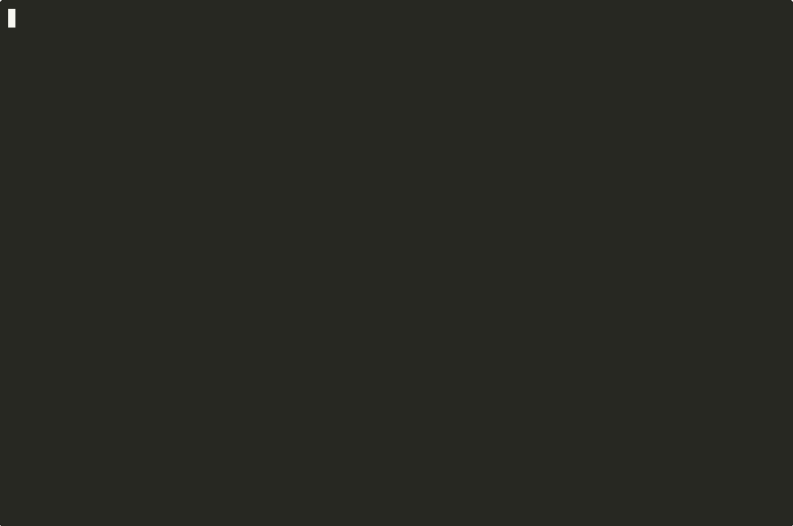
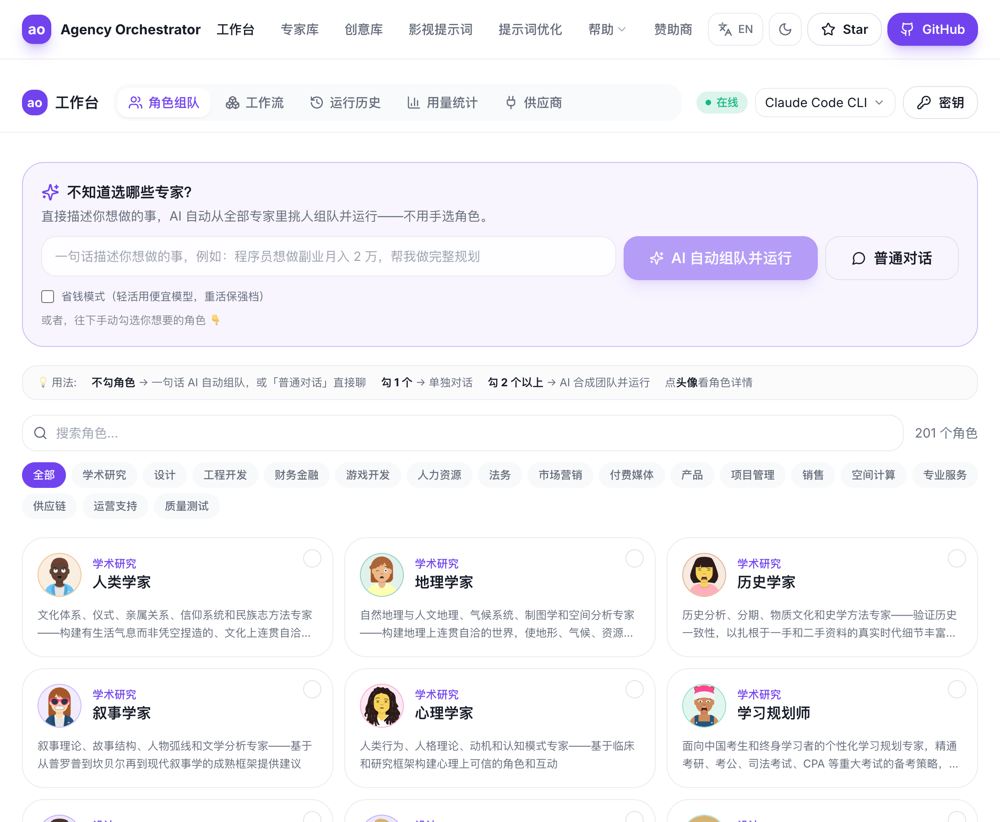
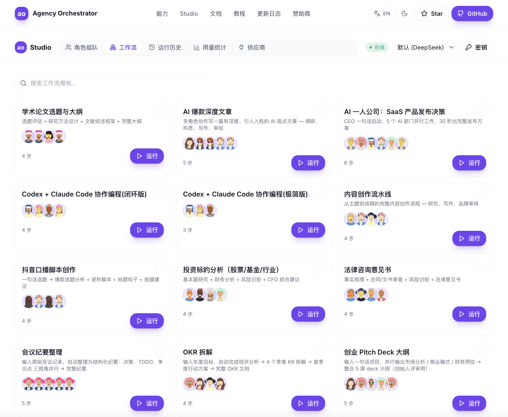

# Agency Orchestrator

**中文** | [English](./README.en.md)

> **一句话，让多个 AI 角色自动协作，几分钟出完整方案。**

[](https://github.com/jnMetaCode/agency-orchestrator/actions)
[](https://www.npmjs.com/package/agency-orchestrator)
[](./LICENSE)
[](./CONTRIBUTING.md)

**一句话出结果 · 216 个专业 AI 角色 · YAML 零代码 · 10 种大模型 · 支持 key（推荐 DeepSeek），也有 7 种免 key 方式**

> 📖 [完整上手教程](https://mp.weixin.qq.com/s/XcGbkMb6TM6NLQiL7ICwbw) — 从安装到实战，10 分钟上手

> 觉得有用？请点个 **Star** — 帮助更多人发现这个项目。

<p align="center">
  
</p>

---

## 网页 Studio（图形界面）

不想敲命令行？本地跑一条 `ao web`，浏览器里勾选专家、运行工作流、查看产物、实时介入——全程图形界面，全中英双语。

<p align="center">
  <br/>
  <em>角色组队：从 200+ 专家里勾选，AI 自动合成团队并运行</em>
</p>

<p align="center">
  <br/>
  <em>工作流：内置模板一键运行，也能对比多个模板</em>
</p>

> 启动：`ao web`（本地，密钥只存你自己机器、绝不外传）。也有 [桌面客户端下载](https://github.com/jnMetaCode/agency-orchestrator/releases/latest)（Electron · macOS / Windows / Linux）。
> 英文界面同样完整 → 见 [English README](./README.en.md)。

---

## 一句话出结果

```bash
ao compose "我是一个程序员，想用AI做自媒体副业，目标月入2万，帮我做完整规划" --run
```

5 个 AI 角色自动分工协作：

```
  工作流: 程序员AI自媒体副业规划
  步骤数: 5 | 模型: claude-code
  参与者: 🔭 趋势研究员 | 📱 平台分析师 | 💰 财务规划师 | ✍️ 内容策略师 | 📋 执行规划师
──────────────────────────────────────────────────

  ✅ 🔭 趋势研究员    31.3s  → 6个赛道竞争度/变现天花板/AI提效倍数对比
  ✅ 📱 平台分析师    32.0s  → 6大平台三维评分，推荐"小红书+公众号"组合
  ✅ 💰 财务规划师    31.8s  → 月入2万拆解：课程¥11,880 + 社群¥2,488 + 咨询¥4,000
  ✅ ✍️ 内容策略师    44.6s  → 20个选题 + 4套标题模板 + 内容SOP
  ✅ 📋 执行规划师    42.2s  → 90天行动计划，精确到每天做什么

==================================================
  完成: 5/5 步 | 182.1s | 6,493 tokens
==================================================
```

**不用写代码，不用写配置，不用选角色。** 一句话 → AI 自动拆解任务 → 从 216 个角色中匹配 → 按 DAG 并行执行 → 输出完整方案。

### 你能用它做什么

```bash
ao compose "帮我分析做一个AI记账工具的可行性" --run             # 创业可行性分析
ao compose "对比 Cursor、Windsurf 和 Copilot，给出选择建议" --run  # 技术选型报告
ao compose "写一篇关于 AI Agent 趋势的深度文章" --run             # 深度长文写作
ao compose "用 10 万块启动一个 AI 教育项目" --run                 # 商业计划书
ao compose "PR 代码审查，覆盖安全和性能" --run                    # 代码审查报告
ao compose "设计一个 SaaS 产品的定价策略" --run                   # 定价分析
```

每个场景自动匹配不同的 AI 角色组合。

---

## 为什么需要 Agency Orchestrator

跟一个 AI 聊天，它给你一个视角。但做任何决策，你需要产品的视角、技术的视角、财务的视角、营销的视角……

**Agency Orchestrator = 让多个 AI 专家各干各的，最后汇总。相当于一个人 vs 一个团队。**

| | ChatGPT / Claude | CrewAI / LangGraph | **Agency Orchestrator** |
|---|--------|-----------|---------------------|
| 角色数 | 1 个通用 | 自己写 | **216 个专业角色** |
| 使用方式 | 对话 | 写 Python | **一句话 / YAML** |
| API key | — | 必须 | **支持 key，也有 7 种免 key 方式** |
| 依赖 | — | pip + 几十个包 | **npm + 2 个依赖** |
| 并行 | — | 手动建图 | **DAG 自动检测** |
| 中文角色 | — | 无 | **216 个** |
| 价格 | 订阅制 | 开源 + API 费 | **DeepSeek 甜区极低成本，亦可免 key 起步** |

## 3 步开始

### 第 1 步：安装

```bash
npm install -g agency-orchestrator
```

### 第 2 步：一句话跑起来

```bash
# 用你已有的 Claude 会员（无需 API key）
ao compose "帮我分析做一个AI记账工具的可行性" --run --provider claude-code

# 或用 DeepSeek（充 10 块跑很久）
export DEEPSEEK_API_KEY="你的key"
ao compose "帮我分析做一个AI记账工具的可行性" --run
```

### 第 3 步：用内置模板或在 AI 编程工具中使用

```bash
# 用 32 个内置模板
ao run workflows/一人公司全员大会.yaml --input idea="帮打工人用AI写简历的求职神器"
ao run workflows/dev/pr-review.yaml --input code=@src/main.ts
ao run workflows/story-creation.yaml -i premise="一个程序员发现AI开始回复不该知道的事情"
```

也可以在 Cursor / Claude Code 中直接说"帮我跑一个工作流"——支持 **14 个 AI 编程工具**（[集成指南](./integrations/)）。

## 更多真实演示

```
$ ao compose "帮我分析抖音短视频赛道的创业机会" --run

  工作流: 抖音短视频赛道创业机会分析与商业方案制定
  步骤数: 6 | 并发: 2 | 模型: deepseek-chat
  参与者: 👔 老板 | 📊 市场调研员 | 🔍 用户研究员 | 🧭 产品经理 | 📣 营销主管 | 💰 财务总监
──────────────────────────────────────────────────

  ✅ 👔 老板          12.7s   → 战略方向与目标用户定位
  ✅ 📊 市场调研员    45.2s   → 7亿日活用户数据、竞争格局分析
  ✅ 🔍 用户研究员    38.1s   → 用户画像、痛点挖掘、付费意愿
  ✅ 🧭 产品经理      41.3s   → MVP功能清单、内容矩阵、变现路径
  ✅ 📣 营销主管      35.6s   → 冷启动方案、投放策略、用户漏斗
  ✅ 💰 财务总监      28.4s   → 150万启动、首年400万收入、盈亏平衡分析

==================================================
  完成: 6/6 步 | 233.0s | 65,191 tokens
==================================================
```

6 个角色中，市场调研员和用户研究员**自动并行执行**（从 DAG 依赖关系检测）。

## 工作原理

```yaml
name: "产品需求评审"
agents_dir: "agency-agents-zh"

llm:
  provider: "deepseek"          # 免 API key: claude-code / gemini-cli / copilot-cli / codex-cli / hermes-cli / ollama
  model: "deepseek-chat"

concurrency: 2

inputs:
  - name: prd_content
    required: true

steps:
  - id: analyze
    role: "product/product-manager"
    task: "分析以下 PRD，提取核心需求：\n\n{{prd_content}}"
    output: requirements

  - id: tech_review
    role: "engineering/engineering-software-architect"
    task: "评估技术可行性：\n\n{{requirements}}"
    output: tech_report
    depends_on: [analyze]

  - id: design_review
    role: "design/design-ux-researcher"
    task: "评估用户体验风险：\n\n{{requirements}}"
    output: design_report
    depends_on: [analyze]

  - id: summary
    role: "product/product-manager"
    task: "综合反馈输出结论：\n\n{{tech_report}}\n\n{{design_report}}"
    depends_on: [tech_review, design_review]
```

引擎自动：

1. 解析 YAML → 构建 **DAG**（有向无环图）
2. 检测并行 — `tech_review` 和 `design_review` 并发执行
3. 通过 `{{变量}}` 在步骤间传递输出
4. 从 [agency-agents-zh](https://github.com/jnMetaCode/agency-agents-zh) 加载角色定义作为 system prompt
5. 失败自动重试（指数退避）
6. 保存所有输出到 `ao-output/`

```
analyze ──→ tech_review  ──→ summary
         └→ design_review ──┘
          (并行)
```

## 10 种 LLM — 7 种不需要 API key

**你已经有这些会员了吧？直接就能跑：**

| 你有... | YAML 配置 | 安装 CLI | 额外费用 |
|---------|----------|---------|---------|
| Claude Max/Pro（$20/月） | `provider: "claude-code"` | `npm i -g @anthropic-ai/claude-code` | **不花钱** |
| Google 账号 | `provider: "gemini-cli"` | `npm i -g @google/gemini-cli` | **免费**（1000 次/天，Gemini 2.5 Pro） |
| GitHub Copilot（$10/月） | `provider: "copilot-cli"` | `npm i -g @github/copilot` | **不花钱** |
| ChatGPT Plus/Pro（$20/月） | `provider: "codex-cli"` | `npm i -g @openai/codex` | **不花钱** |
| OpenClaw 账号 | `provider: "openclaw-cli"` | `npm i -g openclaw` | **不花钱** |
| Hermes Agent（🔥 NousResearch 热门开源） | `provider: "hermes-cli"` | [安装指南](https://github.com/NousResearch/hermes-agent) | **免费** |
| 一台电脑 | `provider: "ollama"` | [ollama.ai](https://ollama.ai) | **免费**（本地模型，见下方提示） |

> ⚠️ **模型能力决定多智能体的价值**：我们用质量评测验证过（见 [EVAL_FINDINGS.md](EVAL_FINDINGS.md)）——**DeepSeek 这一档（够强又不贵）上，多智能体产出明显优于单次 prompt**；但**本地小模型（如 llama3 8B 级）能力不足时，多角色交接反而会放大漂移、产出不如单次**。追求质量请用 DeepSeek/Claude/Gemini 等有能力的模型；本地 Ollama 建议用 70B+ 模型。

**也支持传统 API key（追求质量推荐 DeepSeek，性价比甜区）：**

| 提供商 | 配置 | 环境变量 |
|--------|------|---------|
| DeepSeek | `provider: "deepseek"` | `DEEPSEEK_API_KEY` |
| Claude API | `provider: "claude"` | `ANTHROPIC_API_KEY` |
| OpenAI | `provider: "openai"` | `OPENAI_API_KEY` |

**自定义 API（火山引擎、智谱、月之暗面、硅基流动等 OpenAI 兼容 API）：**

```bash
ao init --provider openai --model 模型名 \
  --base-url https://你的API地址/v1 \
  --api-key 你的key
```

或手动编辑 `.env`：

```env
AO_PROVIDER=openai
AO_MODEL=模型名
OPENAI_BASE_URL=https://你的API地址/v1
OPENAI_API_KEY=你的key
```

常见示例：

| 平台 | base_url | model |
|------|----------|-------|
| 火山引擎 | `https://ark.cn-beijing.volces.com/api/coding/v3` | `ark-code-latest` |
| 智谱 AI | `https://open.bigmodel.cn/api/paas/v4` | `glm-4` |
| 硅基流动 | `https://api.siliconflow.cn/v1` | `deepseek-ai/DeepSeek-V3` |
| 月之暗面 | `https://api.moonshot.cn/v1` | `moonshot-v1-8k` |

> ⚠️ 注意：这些平台请使用 `provider: "openai"`，不要用 `provider: "ollama"`。Ollama 仅用于本地模型，不发送 API Key。

## CLI 命令

```bash
ao demo                              # 零配置体验多智能体协作
ao init                              # （可选）复制 216 个中文角色到本地以便编辑
ao init --lang en                    # （可选）复制 184 个英文角色到本地以便编辑
ao init --workflow                    # 交互式创建工作流
ao compose "一句话描述"                # AI 智能编排工作流
ao compose "一句话描述" --run          # 编排并立即执行
ao team save <workflow.yaml>          # 把角色阵容存成可复用团队 (Loadout)
ao team list / show / rm              # 管理已保存的团队
ao run --team <名字> "新任务"          # 用已保存的团队跑新任务（锁定阵容）
ao prompt optimize "提示词"           # AI 优化提示词（--save 存为可复用资产）
ao prompt test / list / garden        # 测试 / 管理 / 起手模板（提示词沉淀）
ao run <workflow.yaml> [选项]          # 执行工作流
ao validate <workflow.yaml>           # 校验（不执行）
ao plan <workflow.yaml>               # 查看执行计划（DAG）
ao explain <workflow.yaml>            # 用自然语言解释执行计划
ao roles                             # 列出所有角色
ao serve                             # 启动 MCP Server（供 Claude Code / Cursor 调用）
```

| 参数 | 说明 |
|------|------|
| `--input key=value` | 传入输入变量 |
| `--input key=@file` | 从文件读取变量值 |
| `--output dir` | 输出目录（默认 `ao-output/`） |
| `--resume <dir\|last>` | 从上次运行恢复（加载已完成步骤的输出） |
| `--from <step-id>` | 配合 `--resume`，从指定步骤重新执行 |
| `--feedback "意见"` | 对话式返工：把修改意见交给 `--from` 指定的专家，让它带着「上一版产出 + 你的意见」在原稿基础上修改（不指定 `--resume` 时默认对上一次运行返工） |
| `--watch` | 实时终端进度显示 |
| `--quiet` | 静默模式 |

### AI 智能编排（Compose）

一句话描述需求，AI 自动从 216 个角色中选角色、设计 DAG、生成完整 workflow YAML：

```bash
ao compose "PR 代码审查，要覆盖安全和性能"
```

AI 会自动：
1. 从 216 角色中匹配出 Code Reviewer、Security Engineer、Performance Benchmarker
2. 设计 DAG（三路并行 → 汇总）
3. 生成带 `depends_on`、变量串联的完整 YAML
4. 保存到 `workflows/` — 直接 `ao run` 就能跑

支持 `--provider` 和 `--model` 参数（默认使用 DeepSeek）。

### 团队 / Loadout（把跑得好的阵容存下来复用）

`compose` 每次都是临时组队。如果某个角色阵容效果好，把它**存成团队**，套到任意新任务上——团队只保存「角色阵容」，与具体任务解耦：

```bash
# 从一个跑得好的工作流抽出阵容，存成团队
ao team save workflows/tech-blog.yaml --name 技术博客组

# 让整队人接新活（自动用这几个角色重新设计步骤并运行）
ao run --team 技术博客组 "写一篇关于 RISC-V 架构的科普"

ao team list           # 查看已保存的团队
ao team show 技术博客组  # 查看阵容构成
```

`ao run --team` 的本质 = compose 时把可选角色**锁定**为团队那几个，所以既不会漏人、也不会幻觉出别的角色。团队存在 `~/.ao/teams/*.team.yaml`（纯 YAML，可直接拷贝分享），**命令行和网页 Studio 共用同一份**——Studio 里勾选角色后点「存为团队」，命令行立刻 `ao run --team` 可用，反之亦然。

> 自带私有专家：设环境变量 `AO_AGENTS_DIR=/你的角色目录`，`run / compose / roles / web` 全部改用你自己的角色库。
>
> 固定全局目录：设 `AO_HOME=~/.ao`（或任意目录），运行产物 `ao-output`、`compose`/`--team` 生成的工作流都落到那里，不再随执行目录散落（#20）。也可用 `AO_OUTPUT_DIR` / `AO_WORKFLOWS_DIR` 单独指定。不设则维持原行为（写到当前目录）。

### 提示词优化（Prompt Lab）

把「靠感觉」的提示词，变成可优化、可测试、可对比、可沉淀的资产：

```bash
ao prompt optimize "帮我写个朋友圈文案卖咖啡" --save 咖啡文案   # AI 把它改写成更有效的提示词
ao prompt test "你是专业翻译，只输出译文" --mode system --input "good morning"  # 用样例实跑看输出
ao prompt list / show 咖啡文案     # 已保存的提示词 + 版本历史
ao prompt garden                  # 内置起手模板
```

`--mode system|user` 区分「角色/系统提示词」和「任务提示词」。优化只产出**更好的提示词**（不会直接去执行它）。网页 Studio 的「提示词」页还能原版 vs 优化版**并排对比 + AI 评分**。存在 `~/.ao/prompts/`（`AO_PROMPTS_DIR` 可改），命令行与 Studio 共用。

### 迭代优化（Resume）

跑完一轮觉得某步不满意？不用从头来。`--resume` 加载上一轮输出，`--from` 指定从哪步重跑：

```bash
# 第一轮：正常运行
ao run workflows/一人公司全员大会.yaml -i idea="用AI帮小商家做短视频"

# 觉得营销方案不够好？只重跑营销和后续步骤
ao run workflows/一人公司全员大会.yaml --resume last --from marketing_plan

# 只改最终汇总
ao run workflows/一人公司全员大会.yaml --resume last --from launch_decision
```

每轮输出保存在 `ao-output/` 下独立目录，所有版本都保留，随时可以回溯。

| 场景 | 命令 |
|------|------|
| 第一次运行 | `ao run workflow.yaml -i key=value` |
| 从某步重跑 | `ao run workflow.yaml --resume last --from <步骤ID>` |
| 只重跑失败的步骤 | `ao run workflow.yaml --resume last` |
| 基于指定版本重跑 | `ao run workflow.yaml --resume ao-output/具体目录/ --from <步骤ID>` |

### 对话式返工（Feedback）

`--resume --from` 是「让某个专家重做」，但默认是**从零重写**。如果你只是想说一句「这里改一下」，用 `--feedback`——它把你的意见 + 这个专家**上一版的产出**一起交回去，让它在原稿基础上改，而不是推倒重来：

```bash
# 觉得故事结尾太平淡 —— 直接跟"写故事"那个专家说怎么改
ao run workflows/story-creation.yaml --from write_story \
  --feedback "结尾太平淡，加一个反转，并收束前面埋的伏笔"

# 觉得营销方案不接地气
ao run workflows/一人公司全员大会.yaml --from marketing_plan \
  --feedback "预算改成 5000 以内，渠道聚焦小红书 + 私域"
```

不写 `--resume` 时默认对**上一次运行**返工（等价于 `--resume last`）。该专家改完后，它的下游步骤会自动用新产出重跑。

## 编程 API

```typescript
import { run } from 'agency-orchestrator';

const result = await run('workflow.yaml', {
  prd_content: '你的 PRD 内容...',
});

console.log(result.success);     // true/false
console.log(result.totalTokens); // { input: 1234, output: 5678 }
```

## MCP Server 模式

AI 编程工具（Claude Code、Cursor 等）可通过 MCP 协议直接调用工作流操作，无需手动集成：

```bash
ao serve              # 启动 MCP stdio 服务器
ao serve --verbose    # 带调试日志
```

配置 Claude Code（`settings.json`）：

```json
{
  "mcpServers": {
    "agency-orchestrator": {
      "command": "npx",
      "args": ["agency-orchestrator", "serve"]
    }
  }
}
```

配置 Cursor（`.cursor/mcp.json`）：

```json
{
  "mcpServers": {
    "agency-orchestrator": {
      "command": "npx",
      "args": ["agency-orchestrator", "serve"]
    }
  }
}
```

提供 6 个工具：`run_workflow`、`validate_workflow`、`list_workflows`、`plan_workflow`、`compose_workflow`、`list_roles`。

## YAML Schema

### 工作流

| 字段 | 类型 | 必填 | 说明 |
|------|------|------|------|
| `name` | string | 是 | 工作流名称 |
| `agents_dir` | string | 是 | 角色目录路径 |
| `llm.provider` | string | 是 | `claude-code` / `gemini-cli` / `copilot-cli` / `codex-cli` / `openclaw-cli` / `hermes-cli` / `ollama` / `claude` / `deepseek` / `openai` |
| `llm.model` | string | 是 | 模型名称 |
| `llm.max_tokens` | number | 否 | 默认 4096 |
| `llm.timeout` | number | 否 | 步骤超时毫秒数（默认 API 120000 / CLI/ollama 600000）。因超时重试时自动 x1.5 递增，上限 3600000。`0` 表示不限时 |
| `llm.retry` | number | 否 | 重试次数（默认 3） |
| `concurrency` | number | 否 | 最大并行步骤数（默认 2） |
| `inputs` | array | 否 | 输入变量定义 |
| `steps` | array | 是 | 工作流步骤 |

### 步骤

| 字段 | 类型 | 必填 | 说明 |
|------|------|------|------|
| `id` | string | 是 | 步骤唯一标识 |
| `role` | string | 是 | 角色路径（如 `"engineering/engineering-sre"`） |
| `task` | string | 是 | 任务描述，支持 `{{变量}}` |
| `output` | string | 否 | 输出变量名 |
| `depends_on` | string[] | 否 | 依赖的步骤 ID |
| `depends_on_mode` | string | 否 | `"all"`（默认）或 `"any_completed"`（任一完成即可） |
| `condition` | string | 否 | 条件表达式，不满足则跳过（如 `"{{var}} contains 技术"`） |
| `type` | string | 否 | `"approval"` 人工审批节点 / `"human_input"` 人工输入节点（跑到该步暂停，读取你的输入作为该步产出注入下游） |
| `prompt` | string | 否 | `approval` / `human_input` 节点的提示文本 |
| `loop` | object | 否 | 循环配置 |
| `loop.back_to` | string | 否 | 循环回到的步骤 ID |
| `loop.max_iterations` | number | 否 | 最大循环次数（1-10） |
| `loop.exit_condition` | string | 否 | 退出条件表达式 |

## 输出

每次运行保存到 `ao-output/<名称>-<时间戳>/`：

```
ao-output/产品需求评审-2026-03-22/
├── summary.md          # 最终步骤输出
├── steps/
│   ├── 1-analyze.md
│   ├── 2-tech_review.md
│   ├── 3-design_review.md
│   └── 4-summary.md
└── metadata.json       # 耗时、token 用量、步骤状态
```

## 内置工作流模板（32 个）

### 开发类（7 个）

| 模板 | 角色 | 说明 |
|------|------|------|
| `dev/tech-design-review.yaml` | 架构师、后端架构师、安全工程师、代码审查员 | **技术方案评审**（设计→并行评审→结论） |
| `dev/pr-review.yaml` | 代码审查员、安全工程师、性能基准师 | PR 评审（3 路并行→汇总） |
| `dev/tech-debt-audit.yaml` | 架构师、代码审查员、测试分析师、Sprint 排序师 | 技术债务审计（并行→优先级排序） |
| `dev/api-doc-gen.yaml` | 技术文档工程师、API 测试员 | API 文档生成（分析→验证→定稿） |
| `dev/readme-i18n.yaml` | 内容创作者、技术文档工程师 | README 国际化 |
| `dev/security-audit.yaml` | 安全工程师、威胁检测工程师 | 安全审计（并行→报告） |
| `dev/release-checklist.yaml` | SRE、性能基准师、安全工程师、产品经理 | 发布 Go/No-Go 决策 |

### 营销类（3 个）

| 模板 | 角色 | 说明 |
|------|------|------|
| `marketing/competitor-analysis.yaml` | 趋势研究员、数据分析师、SEO 专家、高管摘要师 | **竞品分析报告**（研究→并行分析→摘要） |
| `marketing/xiaohongshu-content.yaml` | 小红书专家、内容创作者、视觉叙事师、小红书运营 | **小红书种草笔记**（选题→并行创作→优化） |
| `marketing/seo-content-matrix.yaml` | SEO 专家、策略师、内容创作者 | **SEO 内容矩阵**（关键词→策略→批量生成→审核） |

### 数据 / 设计 / 运维类（7 个）

| 模板 | 角色 | 说明 |
|------|------|------|
| `data/data-pipeline-review.yaml` | 数据工程师、数据库优化师、数据分析师 | 数据管道评审 |
| `data/dashboard-design.yaml` | 数据分析师、UX 研究员、UI 设计师 | 仪表盘设计 |
| `design/requirement-to-plan.yaml` | 产品经理、架构师、项目经理 | 需求→技术设计→任务拆分 |
| `design/ux-review.yaml` | UX 研究员、无障碍审核员、UX 架构师 | UX 评审 |
| `ops/incident-postmortem.yaml` | 事故指挥官、SRE、产品经理 | 事故复盘 |
| `ops/sre-health-check.yaml` | SRE、性能基准师、基础设施运维师 | SRE 健康检查（3 路并行） |
| `ops/weekly-report.yaml` | 会议助手、内容创作者、高管摘要师 | **周报/月报生成**（整理→亮点→定稿） |

### 战略 / 法务 / HR 类（3 个）

| 模板 | 角色 | 说明 |
|------|------|------|
| `strategy/business-plan.yaml` | 趋势研究员、财务预测师、产品经理、高管摘要师 | **商业计划书**（市场→并行分析→整合） |
| `legal/contract-review.yaml` | 合同审查专家、法务合规员 | **合同审查**（逐条分析→合规检查→意见书） |
| `hr/interview-questions.yaml` | 招聘专家、心理学家、后端架构师 | **面试题设计**（维度→并行出题→评分表） |

### 通用类（12 个）

| 模板 | 角色 | 说明 |
|------|------|------|
| `product-review.yaml` | 产品经理、架构师、UX 研究员 | 产品需求评审 |
| `content-pipeline.yaml` | 策略师、创作者、增长黑客 | 内容创作流水线 |
| `story-creation.yaml` | 叙事学家、心理学家、叙事设计师、创作者 | 协作小说创作（4 角色） |
| `ai-opinion-article.yaml` | 趋势研究员、叙事设计师、心理学家、创作者 | AI 观点长文 |
| `department-collab/code-review.yaml` | 代码审查员、安全工程师 | 代码评审（循环） |
| `department-collab/hiring-pipeline.yaml` | HR、技术面试官、业务面试官 | 招聘流程 |
| `department-collab/content-publish.yaml` | 内容创作者、品牌守护者 | 内容发布（循环） |
| `department-collab/incident-response.yaml` | SRE、安全工程师、后端架构师 | 事故响应 |
| `department-collab/marketing-campaign.yaml` | 策略师、创作者、审批人 | 营销活动（人工审批） |
| `department-collab/ceo-org-delegation.yaml` | CEO、工程/市场/产品/HR 部门负责人 | **CEO 组织架构协作**（决策→部门并行→汇总） |
| `一人公司全员大会.yaml` | CEO、市场调研员、用户研究员、产品经理、市场负责人、CFO | **一人公司全员大会**（CEO→6 部门并行→决策） |
| `ai-startup-launch.yaml` | CEO、产品经理、架构师、市场负责人、财务顾问 | **SaaS 产品发布决策**（CEO→4 部门并行→发布计划） |

## 生态与社区

```
你的 AI 会员 ──→ agency-orchestrator ──→ 400+ 个 AI 角色协作 ──→ 高质量输出
                     │                  (216 中文 + 184 英文)
    ┌────────────────┼────────────────┐
    ▼                ▼                ▼
  14 个 AI 编程工具    CLI 模式         MCP Server
  (Cursor/Claude     (自动化/CI/CD)   (Claude Code/
   Code/Copilot...)                   Cursor 直接调用)
```

| 项目 | 定位 | 一句话 |
|------|------|-------|
| **本项目**（agency-orchestrator） | 🚀 编排引擎 | 一句话 → 216 专家协作，**几分钟出方案**（10 家 LLM / 7 免费） |
| [agency-agents-zh](https://github.com/jnMetaCode/agency-agents-zh)  | 🎭 中文角色库 | 216 个**即插即用** AI 专家，含 50 中国原创（小红书 / 抖音 / 飞书 / 钉钉） |
| [agency-agents](https://github.com/msitarzewski/agency-agents) | 🎭 英文角色库 | 184 个英文 AI 角色 by [@msitarzewski](https://github.com/msitarzewski) |
| [superpowers-zh](https://github.com/jnMetaCode/superpowers-zh)  | 🧠 工作方法论 | 20 个 skills 教 AI 怎么干活（TDD / 调试 / 代码审查等） |
| [ai-coding-guide](https://github.com/jnMetaCode/ai-coding-guide) | 📖 实战教程 | 66 个 Claude Code 技巧 + 9 款工具最佳实践 + 配置模板 |
| [shellward](https://github.com/jnMetaCode/shellward) | 🛡️ 安全中间件 | 8 层防御 + DLP 数据流 + 注入检测，**零依赖**（含 MCP Server） |
| 🆕 [ai-shortfilm-prompts](https://github.com/jnMetaCode/ai-shortfilm-prompts) | 🎬 视频提示词 | Mx-Shell《丧尸清道夫》5 段式方法论 + Skill，Seedance / 小云雀 / Sora / 可灵 / 即梦通用 |
| 🆕 [codepet](https://github.com/jnMetaCode/codepet)  | 🐾 桌面宠物 | 挂在桌面的桌宠，你写代码 / 用 Claude Code 它就涨经验、升级、换状态、冒话（Electron · 仅读元数据，本地优先） |

### 交流

微信公众号 **「AI不止语」**（微信搜索 `AI_BuZhiYu`）— 技术问答 · 项目更新 · 实战文章

| 渠道 | 加入方式 |
|------|---------|
| QQ 2群 | [点击加入](https://qm.qq.com/q/EeNQA9xCxy)（群号 1071280067） |
| 微信群 | 关注公众号后回复「群」获取入群方式 |

## 路线图

- [x] **v0.1** — YAML 工作流、DAG 引擎、4 个 LLM 连接器、CLI、实时输出
- [x] **v0.2** — 条件分支、循环迭代、人工审批、Resume 断点续跑、5 个部门协作模板
- [x] **v0.3** — 9 个 AI 工具集成、20+ 工作流模板、`ao explain`、`ao init --workflow`、`--watch` 模式
- [x] **v0.4** — MCP Server 模式（`ao serve`）、14 个 AI 工具集成、一键安装脚本、32 个工作流模板、**10 种 LLM（7 种免 API key：Claude Code / Gemini / Copilot / Codex / OpenClaw / Hermes / Ollama）**
- [x] **v0.5** — `ao compose --run` 一句话出结果、实时流式输出、智能重试（指数退避）、步骤级模型覆盖、Agent 身份标识
- [ ] **v0.6** — Web UI、可视化 DAG 编辑器、英文工作流模板、工作流市场

## 贡献

参见 [CONTRIBUTING.md](./CONTRIBUTING.md)，欢迎 PR！

## 许可证

[Apache-2.0](./LICENSE)
